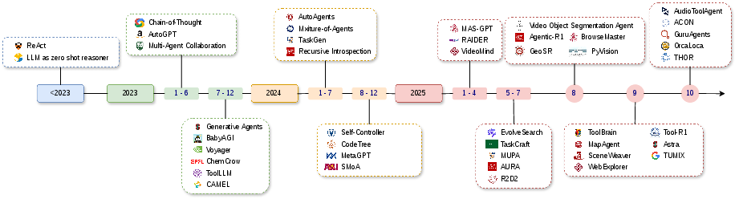
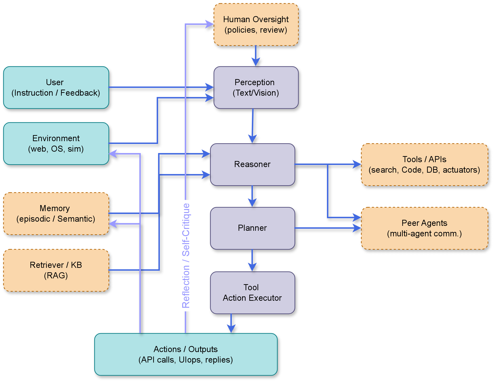
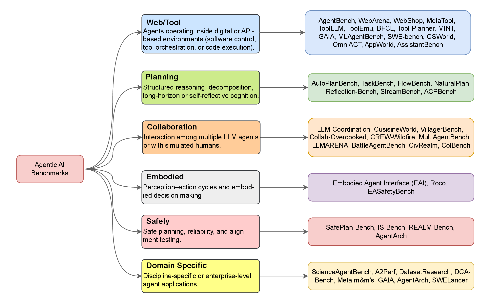
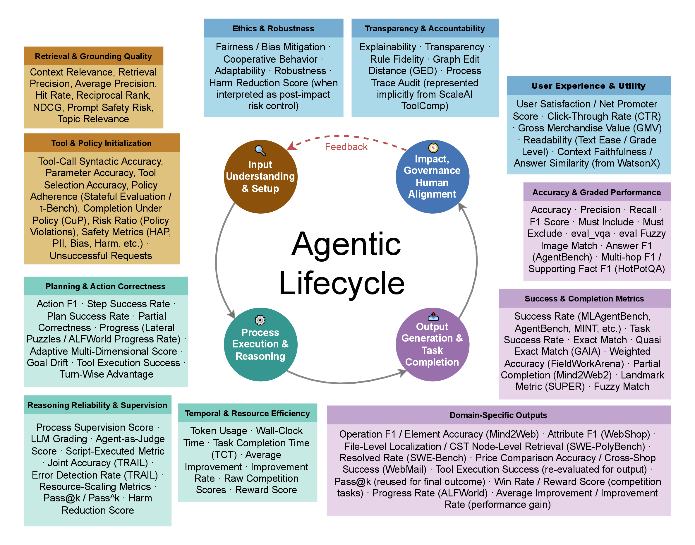
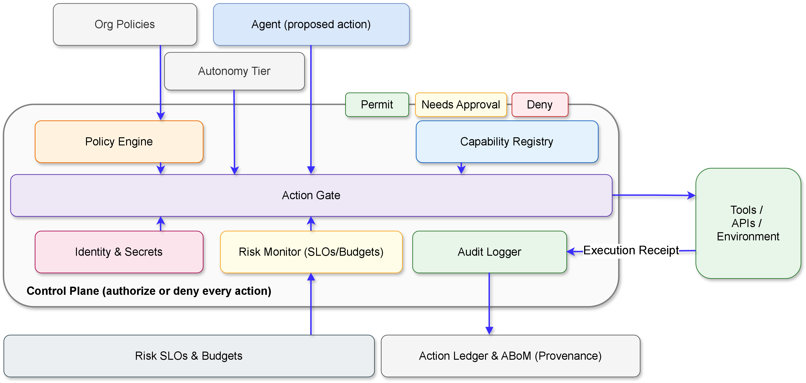

<div align="center">

# Evaluating and Regulating Agentic AI

### A Study of Benchmarks, Metrics, and Regulation

[](https://www.sciencedirect.com/science/article/pii/S1566253526003246)
[](https://www.techrxiv.org/doi/full/10.36227/techrxiv.176186841.18883348/v1)
[](https://github.com/itsazibfarooq/agenticEvaluation)
[](http://creativecommons.org/licenses/by-sa/4.0/)
[](CONTRIBUTING.md)

<br/>

**[Azib Farooq](https://github.com/itsazibfarooq)<sup>1†</sup> · [Shaina Raza](https://vectorinstitute.ai/)<sup>2†</sup> · Nazmul Karim<sup>1</sup> · Hasan Iqbal<sup>3</sup> · Athanasios V. Vasilakos<sup>4‡</sup> · Christos Emmanouilidis<sup>5‡</sup>**

<sup>1</sup>University of Central Florida · <sup>2</sup>Vector Institute, Toronto · <sup>3</sup>Rocket Companies · <sup>4</sup>University of Agder (UiA) · <sup>5</sup>University of Groningen

<sup>†</sup>Equal Contribution · <sup>‡</sup>Senior Authors

<br/>

[📄 Paper](https://www.sciencedirect.com/science/article/pii/S1566253526003246) · [💻 Code](https://github.com/itsazibfarooq/agenticEvaluation) · [🌐 Website](https://itsazibfarooq.github.io/agenticEvaluation/)

</div>

---

## Abstract

> Agentic AI represents a new generation of AI systems capable of **perceiving, reasoning, planning, and acting** toward achieving goals with a degree of autonomy. Unlike traditional AI models that merely generate outputs, these systems maintain memory, interact with their environment, and adapt over time. However, evaluating such interactive and evolving behavior remains a significant challenge.
>
> This survey addresses that gap by reviewing recent progress in the evaluation and assessment of agentic AI, focusing on **three core dimensions: benchmarks, metrics, and governance**. We analyze how current evaluation frameworks capture reasoning, planning, collaboration, and ethical alignment across single- and multi-agent systems. Ultimately, this study aims to establish a unified foundation for building **trustworthy, auditable, and human-aligned AI agents**.

**Keywords:** `Agentic AI` · `Autonomous Agents` · `Responsible AI` · `Evaluation Frameworks` · `Benchmarks` · `Metrics` · `Governance` · `Trustworthiness` · `Human Alignment` · `Multi-Agent Systems`

---

## Overview

### Timeline of Agentic AI (2023–2025)

<div align="center">
  
  <br/>
  <em>Illustrative timeline of representative agentic AI systems from 2023 to 2025, highlighting major architectural paradigms and emerging research directions.</em>
</div>

<br/>

### Agentic AI Pipeline

<div align="center">
  
  <br/>
  <em>High-level overview of the agentic AI system pipeline, including perception, reasoning, planning, memory, and action components.</em>
</div>

---

## Key Contributions

This survey makes four primary contributions to the field of agentic AI evaluation:

| #   | Contribution                   | Description                                                                                                                                                                                                                 |
| --- | ------------------------------ | --------------------------------------------------------------------------------------------------------------------------------------------------------------------------------------------------------------------------- |
| 1   | **Comprehensive Taxonomy**     | A structured review of benchmarks and evaluation metrics for agentic AI, organized by lifecycle stages — mapping benchmark types, evaluation dimensions, and performance indicators                                         |
| 2   | **Literature Analysis**        | In-depth analysis of emerging trends, methodological gaps, and open challenges in the evaluation of agentic AI across 200+ surveyed papers                                                                                  |
| 3   | **Novel Evaluation Framework** | A unified, lifecycle-aware framework integrating: (1) Benchmark Validity Audit, (2) Gaming Detection Layer, (3) Contamination-Adjusted Scoring, and (4) Validity Compliance SLOs aligned with NIST AI RMF and ISO/IEC 42001 |
| 4   | **Governance Analysis**        | Examination of governance dimensions and regulatory alignment with respect to trust, accountability, and compliance standards                                                                                               |

### Benchmark Taxonomy

<div align="center">
  
  <br/>
  <em>Taxonomy of benchmarks for agentic AI evaluation, organized across domains: web, desktop, software, embodied, multi-agent, planning, and specialized settings.</em>
</div>

<br/>

### Metrics Taxonomy

<div align="center">
  
  <br/>
  <em>Taxonomy of evaluation metrics for agentic AI systems, covering quantitative and qualitative dimensions for measuring performance, reliability, and human alignment.</em>
</div>

<br/>

### Governance & Alignment Framework

<div align="center">
  
  <br/>
  <em>Overview of governance, policy, and alignment dimensions mapped against current agentic AI evaluation frameworks and regulatory standards.</em>
</div>

---

## Paper Organization

| Section | Title                            | Description                                                       |
| ------- | -------------------------------- | ----------------------------------------------------------------- |
| §1      | Introduction                     | Motivation, research questions, and main contributions            |
| §2      | Literature Review Methodology    | Search strategy, inclusion/exclusion criteria, thematic synthesis |
| §3      | Background                       | LLMs, VLMs, RAG, LLM-based agents, and multi-agent systems        |
| §4      | Evaluation Framework             | Novel lifecycle-aware unified evaluation framework                |
| §5      | Benchmarks & Datasets            | Comprehensive review of benchmarks across all major domains       |
| §6      | Evaluation Metrics               | Quantitative and qualitative dimensions for measuring performance |
| §7      | Governance & Regulation          | Policy, audit frameworks, and regulatory compliance               |
| §8      | Contamination & Benchmark Gaming | Evaluation loopholes and benchmark evolution                      |
| §9      | Discussion                       | Open challenges and future directions                             |
| §10     | Conclusion                       | Unified evaluation and governance frameworks                      |

---

## Complete Bibliography

This repository serves as a **living, community-maintained reference** for research on agentic AI evaluation. Below is the comprehensive, categorized bibliography from our paper, with links to papers, codebases, and project pages.

> **Note:** This list is actively maintained. Community contributions are welcome — see the [Contributing](#contributing) section.

<details>
<summary><strong>🤖 Agentic AI & MAS — Surveys & General Concepts (12 papers)</strong></summary>

<br/>

| Authors                     | Year | Title                                                                                                                                                                | Venue                            |
| --------------------------- | ---- | -------------------------------------------------------------------------------------------------------------------------------------------------------------------- | -------------------------------- |
| Acharya, D. B., et al.      | 2025 | [_Agentic AI: Autonomous Intelligence for Complex Goals — A Comprehensive Survey_](https://ieeexplore.ieee.org/document/10849561/)                                   | IEEE Access                      |
| Bandi, A., et al.           | 2025 | [_The Rise of Agentic AI: A Review of Definitions, Frameworks, Architectures, Applications, Evaluation Metrics, and Challenges_](https://doi.org/10.3390/fi17090404) | Future Internet                  |
| Chowa, S. S., et al.        | 2025 | [_From Language to Action: A Review of Large Language Models as Autonomous Agents and Tool Users_](https://arxiv.org/abs/2508.17281)                                 | arXiv                            |
| Guo, T., et al.             | 2024 | [_Large Language Model Based Multi-Agents: A Survey of Progress and Challenges_](https://arxiv.org/abs/2402.01680)                                                   | arXiv                            |
| Hughes, L., et al.          | 2025 | [_AI Agents and Agentic Systems: A Multi-Expert Analysis_](https://www.tandfonline.com/doi/full/10.1080/08874417.2025.2483832)                                       | J. Computer Information Systems  |
| Nisa, U., et al.            | 2025 | [_Agentic AI: The Age of Reasoning — A Review_](https://www.sciencedirect.com/science/article/pii/S2949855425000516)                                                 | J. Automation and Intelligence   |
| Piccialli, F., et al.       | 2025 | [_AgentAI: A Comprehensive Survey on Autonomous Agents in Distributed AI for Industry 4.0_](https://www.sciencedirect.com/science/article/pii/S0957417425020238)     | Expert Systems with Applications |
| Plaat, A., et al.           | 2025 | [_Agentic Large Language Models, a Survey_](https://arxiv.org/abs/2503.23037)                                                                                        | arXiv                            |
| Qu, X., et al.              | 2025 | [_A Comprehensive Review of AI Agents: Transforming Possibilities in Technology and Beyond_](https://arxiv.org/abs/2508.11957)                                       | arXiv                            |
| Russell, S. J. & Norvig, P. | 2021 | _Artificial Intelligence: A Modern Approach_ (4th ed.)                                                                                                               | Pearson                          |
| Wang, L., et al.            | 2024 | [_A Survey on Large Language Model Based Autonomous Agents_](https://arxiv.org/abs/2308.11432)                                                                       | Frontiers of Computer Science    |
| Wooldridge, M.              | 2009 | _An Introduction to MultiAgent Systems_ (2nd ed.)                                                                                                                    | Wiley                            |

</details>

<details>
<summary><strong>🏗️ Agent Architectures, Reasoning & Frameworks (25 papers)</strong></summary>

<br/>

| Authors                    | Year | Title                                                                                                                                       | Venue                            |
| -------------------------- | ---- | ------------------------------------------------------------------------------------------------------------------------------------------- | -------------------------------- |
| Ahn, M., et al.            | 2022 | [_Do As I Can, Not As I Say: Grounding Language in Robotic Affordances_](https://arxiv.org/abs/2204.01691)                                  | arXiv                            |
| Belcak, P., et al.         | 2025 | [_Small Language Models are the Future of Agentic AI_](https://arxiv.org/abs/2506.02153)                                                    | arXiv                            |
| Bran, A. M., et al.        | 2023 | [_ChemCrow: Augmenting Large-Language Models with Chemistry Tools_](https://arxiv.org/abs/2304.05376)                                       | arXiv                            |
| Chen, G., et al.           | 2023 | [_AutoAgents: A Framework for Automatic Agent Generation_](https://arxiv.org/abs/2309.17288)                                                | arXiv                            |
| Chen, W., et al.           | 2023 | [_Program of Thoughts Prompting: Disentangling Computation from Reasoning for Numerical Reasoning Tasks_](https://arxiv.org/abs/2211.12588) | arXiv                            |
| Derouiche, H., et al.      | 2025 | [_Agentic AI Frameworks: Architectures, Protocols, and Design Challenges_](https://arxiv.org/abs/2508.10146)                                | arXiv                            |
| Feng, K. J., et al.        | 2025 | [_Levels of Autonomy for AI Agents_](https://arxiv.org/abs/2506.12469)                                                                      | Knight First Amendment Institute |
| Haase, J. & Pokutta, S.    | 2025 | [_Beyond Static Responses: Multi-Agent LLM Systems as a New Paradigm for Social Science Research_](https://arxiv.org/abs/2506.01839)        | arXiv                            |
| Hong, S., et al.           | 2024 | [_MetaGPT: Meta Programming for a Multi-Agent Collaborative Framework_](https://arxiv.org/abs/2308.00352)                                   | ICLR                             |
| Lewis, P., et al.          | 2020 | [_Retrieval-Augmented Generation for Knowledge-Intensive NLP Tasks_](https://arxiv.org/abs/2005.11401)                                      | NeurIPS                          |
| Li, D., et al.             | 2025 | [_SMoA: Improving Multi-Agent Large Language Models with Sparse Mixture-of-Agents_](https://arxiv.org/abs/2411.03284)                       | PAKDD                            |
| Li, G., et al.             | 2023 | [_CAMEL: Communicative Agents for "Mind" Exploration of Large Language Model Society_](https://arxiv.org/abs/2303.17760)                    | NeurIPS                          |
| Nakajima, Y.               | 2023 | [_BabyAGI: An Autonomous Task Management System_](https://github.com/yoheinakajima/babyagi)                                                 | GitHub                           |
| Ouyang, L., et al.         | 2022 | [_Training Language Models to Follow Instructions with Human Feedback_](https://arxiv.org/abs/2203.02155)                                   | NeurIPS                          |
| Park, J. S., et al.        | 2023 | [_Generative Agents: Interactive Simulacra of Human Behavior_](https://arxiv.org/abs/2304.03442)                                            | UIST                             |
| Schick, T., et al.         | 2023 | [_Toolformer: Language Models Can Teach Themselves to Use Tools_](https://arxiv.org/abs/2302.04761)                                         | arXiv                            |
| Shinn, N., et al.          | 2023 | [_Reflexion: Language Agents with Verbal Reinforcement Learning_](https://arxiv.org/abs/2303.11366)                                         | NeurIPS                          |
| Talebirad, Y. & Nadiri, A. | 2023 | [_Multi-Agent Collaboration: Harnessing the Power of Intelligent LLM Agents_](https://arxiv.org/abs/2306.03314)                             | arXiv                            |
| Wang, F., et al.           | 2025 | [_RAG+: Enhancing Retrieval-Augmented Generation with Application-Aware Reasoning_](https://arxiv.org/abs/2506.11555)                       | arXiv                            |
| Wang, G., et al.           | 2023 | [_Voyager: An Open-Ended Embodied Agent with Large Language Models_](https://arxiv.org/abs/2305.16291)                                      | arXiv                            |
| Wang, J., et al.           | 2024 | [_Mixture-of-Agents Enhances Large Language Model Capabilities_](https://arxiv.org/abs/2406.04692)                                          | arXiv                            |
| Wang, X., et al.           | 2022 | [_Self-Consistency Improves Chain of Thought Reasoning in Language Models_](https://arxiv.org/abs/2203.11171)                               | arXiv                            |
| Wu, X., et al.             | 2024 | [_Can Graph Learning Improve Planning in LLM-Based Agents?_](https://arxiv.org/abs/2405.19119)                                              | NeurIPS                          |
| Yang, H., et al.           | 2023 | [_Auto-GPT for Online Decision Making: Benchmarks and Additional Opinions_](https://arxiv.org/abs/2306.02224)                               | arXiv                            |
| Yao, S., et al.            | 2023 | [_ReAct: Synergizing Reasoning and Acting in Language Models_](https://arxiv.org/abs/2210.03629)                                            | ICLR                             |

</details>

<details>
<summary><strong>🔒 Governance, Risk, Security & Safety (28 papers)</strong></summary>

<br/>

| Authors                    | Year | Title                                                                                                                                                                                                                      | Venue                      |
| -------------------------- | ---- | -------------------------------------------------------------------------------------------------------------------------------------------------------------------------------------------------------------------------- | -------------------------- |
| Ahmed, S. Q.               | 2025 | [_Agentic AI: A Governance Wake-Up Call_](https://www.nacdonline.org/all-governance/governance-resources/directorship-magazine/online-exclusives/2025/q3-2025/autonomous-artificial-intelligence-oversight/)               | NACD Directorship Magazine |
| Andriushchenko, M., et al. | 2024 | [_AgentHarm: A Benchmark for Measuring Harmfulness of LLM Agents_](https://arxiv.org/abs/2410.09024)                                                                                                                       | arXiv                      |
| Anthropic                  | 2025 | [_Responsible Scaling Policy, Version 2.1_](https://www.anthropic.com/responsible-scaling-policy)                                                                                                                          | Anthropic                  |
| Debenedetti, E., et al.    | 2024 | [_AgentDojo: A Dynamic Environment to Evaluate Prompt Injection Attacks and Defenses for LLM Agents_](https://arxiv.org/abs/2406.13352)                                                                                    | NeurIPS                    |
| Dong, Y., et al.           | 2024 | [_Building Guardrails for Large Language Models_](https://arxiv.org/abs/2402.01822)                                                                                                                                        | arXiv                      |
| European Union             | 2024 | [_Regulation (EU) 2024/1689 — Artificial Intelligence Act_](https://eur-lex.europa.eu/eli/reg/2024/1689/oj/eng)                                                                                                            | Official Journal of the EU |
| ISO & IEC                  | 2023 | [_ISO/IEC 42001:2023 — Artificial Intelligence Management System_](https://www.iso.org/standard/81230.html)                                                                                                                | ISO                        |
| Levy, I., et al.           | 2024 | [_ST-WebAgentBench: A Benchmark for Evaluating Safety and Trustworthiness in Web Agents_](https://arxiv.org/abs/2410.06703)                                                                                                | arXiv                      |
| Lu, X., et al.             | 2025 | [_IS-Bench: Evaluating Interactive Safety of VLM-Driven Embodied Agents in Daily Household Tasks_](https://arxiv.org/abs/2506.16402)                                                                                       | arXiv                      |
| Marks, S., et al.          | 2025 | [_Auditing Language Models for Hidden Objectives_](https://arxiv.org/abs/2503.10965)                                                                                                                                       | arXiv                      |
| Marks, S., et al.          | 2025 | [_Building and Evaluating Alignment Auditing Agents_](https://alignment.anthropic.com/2025/automated-auditing/)                                                                                                            | AI Alignment Forum         |
| MITRE Corporation          | 2025 | [_ATLAS: Adversarial Threat Landscape for Artificial-Intelligence Systems_](https://atlas.mitre.org/)                                                                                                                      | MITRE                      |
| NIST                       | 2020 | [_Zero Trust Architecture_](https://csrc.nist.gov/pubs/sp/800/207/final) (SP 800-207)                                                                                                                                      | NIST                       |
| NIST                       | 2023 | [_Artificial Intelligence Risk Management Framework (AI RMF 1.0)_](https://nvlpubs.nist.gov/nistpubs/ai/nist.ai.100-1.pdf) (NIST AI 100-1)                                                                                 | NIST                       |
| NTIA                       | 2021 | [_The Minimum Elements for a Software Bill of Materials (SBOM)_](https://www.ntia.gov/report/2021/minimum-elements-software-bill-materials-sbom)                                                                           | NTIA                       |
| Open Policy Agent Project  | 2024 | [_Open Policy Agent: Policy as Code_](https://www.openpolicyagent.org/)                                                                                                                                                    | OPA                        |
| OWASP Foundation           | 2025 | [_OWASP Top 10 for Large Language Model Applications (2025)_](https://genai.owasp.org/resource/owasp-top-10-for-llm-applications-2025/)                                                                                    | OWASP                      |
| Raza, S., et al.           | 2025 | [_TRiSM for Agentic AI: A Review of Trust, Risk, and Security Management_](https://arxiv.org/abs/2506.04133)                                                                                                               | arXiv                      |
| Ruan, Y., et al.           | 2023 | [_Identifying the Risks of LM Agents with an LM-Emulated Sandbox_](https://arxiv.org/abs/2309.15817)                                                                                                                       | arXiv                      |
| Sherman, E., et al.        | 2025 | [_From Assistant to Agent: Navigating the Governance Challenges of Increasingly Autonomous AI_](https://www.credo.ai/resources/from-assistant-to-agent-navigating-the-governance-challenges-of-increasingly-autonomous-ai) | Credo AI                   |
| Shukla, M.                 | 2025 | [_Adaptive Monitoring and Real-World Evaluation of Agentic AI Systems_](https://arxiv.org/abs/2509.00115)                                                                                                                  | arXiv                      |
| SLSA Community             | 2023 | [_SLSA Specification v1.0_](https://slsa.dev/spec/v1.0/about)                                                                                                                                                              | SLSA                       |
| Thurgood, S., et al.       | 2018 | [_Example Error Budget Policy_](https://sre.google/workbook/error-budget-policy/)                                                                                                                                          | Google SRE                 |
| Torres-Arias, S., et al.   | 2019 | [_in-toto: Providing Farm-to-Table Guarantees for Bits and Bytes_](https://www.usenix.org/conference/usenixsecurity19/presentation/torres-arias)                                                                           | USENIX Security            |
| Verifiable Credentials WG  | 2025 | [_Verifiable Credentials Data Model 2.0_](https://www.w3.org/TR/vc-data-model-2.0/)                                                                                                                                        | W3C                        |
| Wang, N., et al.           | 2025 | [_Advancing Embodied Agent Security: From Safety Benchmarks to Input Moderation_](https://arxiv.org/abs/2504.15699)                                                                                                        | arXiv                      |
| Yin, S., et al.            | 2024 | [_SafeAgentBench: A Benchmark for Safe Task Planning of Embodied LLM Agents_](https://arxiv.org/abs/2412.13178)                                                                                                            | arXiv                      |
| Yu, M., et al.             | 2025 | [_A Survey on Trustworthy LLM Agents: Threats and Countermeasures_](https://arxiv.org/abs/2503.09648)                                                                                                                      | KDD                        |

</details>

<details>
<summary><strong>⚖️ Responsible AI, Bias & Human-in-the-Loop (7 papers)</strong></summary>

<br/>

| Authors                   | Year | Title                                                                                                                                                                                    | Venue                          |
| ------------------------- | ---- | ---------------------------------------------------------------------------------------------------------------------------------------------------------------------------------------- | ------------------------------ |
| Mosqueira-Rey, E., et al. | 2023 | [_Human-in-the-Loop Machine Learning: A State of the Art_](https://link.springer.com/article/10.1007/s10462-022-10246-w)                                                                 | Artificial Intelligence Review |
| Raza, S., et al.          | 2024 | [_Exploring Bias and Prediction Metrics to Characterise the Fairness of Machine Learning_](https://arxiv.org/abs/2408.13295)                                                             | IEEE Access                    |
| Raza, S., et al.          | 2025 | [_Developing Safe and Responsible Large Language Model: Can We Balance Bias Reduction and Language Understanding?_](https://arxiv.org/abs/2404.01399)                                    | Machine Learning               |
| Raza, S., et al.          | 2025 | [_HumaniBench: A Human-Centric Framework for Large Multimodal Models Evaluation_](https://arxiv.org/abs/2505.11454)                                                                      | arXiv                          |
| Raza, S., et al.          | 2025 | [_Responsible Agentic Reasoning and AI Agents: A Critical Survey_](https://www.techrxiv.org/users/574774/articles/1329333-responsible-agentic-reasoning-and-ai-agents-a-critical-survey) | Authorea Preprints             |
| Raza, S., et al.          | 2025 | [_ViLBias: Detecting and Reasoning about Bias in Multimodal Content_](https://arxiv.org/abs/2412.17052)                                                                                  | arXiv                          |
| Raza, S., et al.          | 2025 | [_Who is Responsible? The Data, Models, Users or Regulations? A Comprehensive Survey_](https://arxiv.org/abs/2502.08650)                                                                 | arXiv                          |

</details>

<details>
<summary><strong>🧠 Agent Memory (5 papers)</strong></summary>

<br/>

| Authors                | Year | Title                                                                                                           | Venue |
| ---------------------- | ---- | --------------------------------------------------------------------------------------------------------------- | ----- |
| Cherepanov, E., et al. | 2025 | [_Memory, Benchmark & Robots: A Benchmark for Solving Complex Tasks_](https://arxiv.org/abs/2502.10550)         | arXiv |
| Pasukonis, J., et al.  | 2022 | [_Evaluating Long-Term Memory in 3D Mazes_](https://arxiv.org/abs/2210.13383)                                   | arXiv |
| Wang, F., et al.       | 2025 | [_Text2Mem: A Unified Memory Operation Language for Memory Operating System_](https://arxiv.org/abs/2509.11145) | arXiv |
| Xia, M., et al.        | 2025 | [_Minerva: A Programmable Memory Test Benchmark for Language Models_](https://arxiv.org/abs/2502.03358)         | arXiv |
| Xu, W., et al.         | 2025 | [_A-MEM: Agentic Memory for LLM Agents_](https://arxiv.org/abs/2502.12110)                                      | arXiv |

</details>

<details>
<summary><strong>📊 Benchmarking: General & Multi-Domain (18 papers)</strong></summary>

<br/>

| Authors                | Year | Title                                                                                                                      | Venue    |
| ---------------------- | ---- | -------------------------------------------------------------------------------------------------------------------------- | -------- |
| Chang, M., et al.      | 2024 | [_AgentBoard: An Analytical Evaluation Board of Multi-Turn LLM Agents_](https://arxiv.org/abs/2401.13178)                  | NeurIPS  |
| Gioacchini, L., et al. | 2024 | [_AgentQuest: A Modular Benchmark Framework to Measure Progress and Improve LLM Agents_](https://arxiv.org/abs/2404.06411) | arXiv    |
| IBM                    | 2025 | [_Agentic AI Evaluation_](https://www.ibm.com/docs/en/watsonx/saas?topic=sdk-agentic-ai-evaluation)                        | IBM Docs |
| Li, M., et al.         | 2023 | [_API-Bank: A Comprehensive Benchmark for Tool-Augmented LLMs_](https://arxiv.org/abs/2304.08244)                          | arXiv    |
| Liu, X., et al.        | 2023 | [_AgentBench: Evaluating LLMs as Agents_](https://arxiv.org/abs/2308.03688)                                                | arXiv    |
| Mialon, G., et al.     | 2023 | [_GAIA: A Benchmark for General AI Assistants_](https://arxiv.org/abs/2311.12983)                                          | ICLR     |
| Mohammadi, M., et al.  | 2025 | [_Evaluation and Benchmarking of LLM Agents: A Survey_](https://arxiv.org/abs/2507.21504)                                  | KDD      |
| Nath, V., et al.       | 2025 | [_ToolComp: A Multi-Tool Reasoning & Process Supervision Benchmark_](https://arxiv.org/abs/2501.01290)                     | arXiv    |
| Patil, S. G., et al.   | 2024 | [_Gorilla: Large Language Model Connected with Massive APIs_](https://arxiv.org/abs/2305.15334)                            | NeurIPS  |
| Qin, Y., et al.        | 2023 | [_ToolLLM: Facilitating Large Language Models to Master 16000+ Real-World APIs_](https://arxiv.org/abs/2307.16789)         | arXiv    |
| Shen, Y., et al.       | 2024 | [_TaskBench: Benchmarking Large Language Models for Task Automation_](https://arxiv.org/abs/2311.18760)                    | NeurIPS  |
| Uchendu, I., et al.    | 2025 | [_A2Perf: Real-World Autonomous Agents Benchmark_](https://arxiv.org/abs/2503.03056)                                       | arXiv    |
| Wang, X., et al.       | 2023 | [_MINT: Evaluating LLMs in Multi-Turn Interaction with Tools and Language Feedback_](https://arxiv.org/abs/2309.10691)     | arXiv    |
| Wu, C. K., et al.      | 2024 | [_StreamBench: Towards Benchmarking Continuous Improvement of Language Agents_](https://arxiv.org/abs/2406.08747)          | NeurIPS  |
| Xu, F. F., et al.      | 2024 | [_TheAgentCompany: Benchmarking LLM Agents on Consequential Real World Tasks_](https://arxiv.org/abs/2412.14161)           | arXiv    |
| Xu, Q., et al.         | 2023 | [_On the Tool Manipulation Capability of Open-Source Large Language Models_](https://arxiv.org/abs/2305.16504)             | arXiv    |
| Yao, S., et al.        | 2024 | [_τ-Bench: A Benchmark for Tool-Agent-User Interaction in Real-World Domains_](https://arxiv.org/abs/2406.12045)           | arXiv    |
| Yehudai, A., et al.    | 2025 | [_Survey on Evaluation of LLM-Based Agents_](https://arxiv.org/abs/2503.16416)                                             | arXiv    |

</details>

<details>
<summary><strong>🌐 Benchmarking: Web, Desktop & UI Agents (17 papers)</strong></summary>

<br/>

| Authors               | Year | Title                                                                                                                                | Venue            |
| --------------------- | ---- | ------------------------------------------------------------------------------------------------------------------------------------ | ---------------- |
| Chen, J., et al.      | 2024 | [_SPA-Bench: A Comprehensive Benchmark for Smartphone Agent Evaluation_](https://arxiv.org/abs/2410.15164)                           | NeurIPS Workshop |
| Chezelles, D., et al. | 2024 | [_The BrowserGym Ecosystem for Web Agent Research_](https://arxiv.org/abs/2412.05467)                                                | arXiv            |
| Deng, X., et al.      | 2023 | [_Mind2Web: Towards a Generalist Agent for the Web_](https://arxiv.org/abs/2306.06070)                                               | NeurIPS          |
| Gou, B., et al.       | 2025 | [_Mind2Web 2: Evaluating Agentic Search with Agent-as-a-Judge_](https://arxiv.org/abs/2506.21506)                                    | arXiv            |
| Kapoor, R., et al.    | 2024 | [_OmniACT: A Dataset and Benchmark for Enabling Multimodal Generalist Autonomous Agents_](https://arxiv.org/abs/2402.17553)          | ECCV             |
| Koh, J. Y., et al.    | 2024 | [_VisualWebArena: Evaluating Multimodal Agents on Realistic Visual Web Tasks_](https://arxiv.org/abs/2401.13649)                     | arXiv            |
| Pan, Y., et al.       | 2024 | [_WebCanvas: Benchmarking Web Agents in Online Environments_](https://arxiv.org/abs/2406.12373)                                      | arXiv            |
| Peeters, R., et al.   | 2025 | [_WebMall — A Multi-Shop Benchmark for Evaluating Web Agents_](https://arxiv.org/abs/2508.13024)                                     | arXiv            |
| Tian, S., et al.      | 2024 | [_MMInA: Benchmarking Multihop Multimodal Internet Agents_](https://arxiv.org/abs/2404.09992)                                        | arXiv            |
| Trivedi, H., et al.   | 2024 | [_AppWorld: A Controllable World of Apps and People for Benchmarking Interactive Coding Agents_](https://arxiv.org/abs/2407.18901)   | NeurIPS          |
| Wang, H., et al.      | 2025 | [_UI-TARS-2 Technical Report: Advancing GUI Agent with Multi-Turn Reinforcement Learning_](https://arxiv.org/abs/2509.02544)         | arXiv            |
| Wang, J., et al.      | 2024 | [_HammerBench: Fine-Grained Function-Calling Evaluation in Real Mobile Device Scenarios_](https://arxiv.org/abs/2412.16516)          | arXiv            |
| Xie, T., et al.       | 2024 | [_OSWorld: Benchmarking Multimodal Agents for Open-Ended Tasks in Real Computer Environments_](https://arxiv.org/abs/2404.07972)     | NeurIPS          |
| Xing, M., et al.      | 2024 | [_Understanding the Weakness of Large Language Model Agents within a Complex Android Environment_](https://arxiv.org/abs/2402.06596) | KDD              |
| Yao, S., et al.       | 2022 | [_WebShop: Towards Scalable Real-World Web Interaction with Grounded Language Agents_](https://arxiv.org/abs/2207.01206)             | NeurIPS          |
| Yoran, O., et al.     | 2024 | [_AssistantBench: Can Web Agents Solve Realistic and Time-Consuming Tasks?_](https://arxiv.org/abs/2407.15711)                       | arXiv            |
| Zhou, S., et al.      | 2023 | [_WebArena: A Realistic Web Environment for Building Autonomous Agents_](https://arxiv.org/abs/2307.13854)                           | arXiv            |

</details>

<details>
<summary><strong>💻 Benchmarking: Software, ML & Data Science (15 papers)</strong></summary>

<br/>

| Authors                 | Year | Title                                                                                                                                                     | Venue |
| ----------------------- | ---- | --------------------------------------------------------------------------------------------------------------------------------------------------------- | ----- |
| Bogin, B., et al.       | 2024 | [_SUPER: Evaluating Agents on Setting Up and Executing Tasks from Research Repositories_](https://arxiv.org/abs/2409.07440)                               | arXiv |
| Chan, J. S., et al.     | 2024 | [_MLE-Bench: Evaluating Machine Learning Agents on Machine Learning Engineering_](https://arxiv.org/abs/2410.07095)                                       | arXiv |
| Deshpande, D., et al.   | 2025 | [_TRAIL: Trace Reasoning and Agentic Issue Localization_](https://arxiv.org/abs/2505.08638)                                                               | arXiv |
| Huang, B., et al.       | 2025 | [_DCA-Bench: A Benchmark for Dataset Curation Agents_](https://arxiv.org/abs/2406.07275)                                                                  | KDD   |
| Huang, Q., et al.       | 2023 | [_MLAgentBench: Evaluating Language Agents on Machine Learning Experimentation_](https://arxiv.org/abs/2310.03302)                                        | arXiv |
| Jha, S., et al.         | 2025 | [_ITBench: Evaluating AI Agents Across Diverse Real-World IT Automation Tasks_](https://arxiv.org/abs/2502.05352)                                         | arXiv |
| Jimenez, C. E., et al.  | 2023 | [_SWE-Bench: Can Language Models Resolve Real-World GitHub Issues?_](https://arxiv.org/abs/2310.06770)                                                    | arXiv |
| Li, K., et al.          | 2025 | [_DatasetResearch: Benchmarking Agent Systems for Demand-Driven Dataset Discovery_](https://arxiv.org/abs/2508.06960)                                     | arXiv |
| Miserendino, S., et al. | 2025 | [_SWE-Lancer: Can Frontier LLMs Earn $1 Million from Real-World Freelance Software Engineering?_](https://arxiv.org/abs/2502.12115)                       | arXiv |
| Padigela, H., et al.    | 2025 | [_ML-Dev-Bench: Comparative Analysis of AI Agents on ML Development Workflows_](https://arxiv.org/abs/2502.00964)                                         | arXiv |
| Rashid, M. S., et al.   | 2025 | [_SWE-PolyBench: A Multi-Language Benchmark for Repository Level Evaluation of Coding Agents_](https://arxiv.org/abs/2504.08703)                          | arXiv |
| Rein, D., et al.        | 2025 | [_HCAST: Human-Calibrated Autonomy Software Tasks_](https://arxiv.org/abs/2503.17354)                                                                     | arXiv |
| Siegel, Z. S., et al.   | 2024 | [_CORE-Bench: Fostering the Credibility of Published Research through a Computational Reproducibility Agent Benchmark_](https://arxiv.org/abs/2409.11363) | arXiv |
| Starace, G., et al.     | 2025 | [_PaperBench: Evaluating AI's Ability to Replicate AI Research_](https://arxiv.org/abs/2504.01848)                                                        | arXiv |
| Wijk, H., et al.        | 2024 | [_RE-Bench: Evaluating Frontier AI R&D Capabilities of Language Model Agents_](https://arxiv.org/abs/2411.15114)                                          | arXiv |

</details>

<details>
<summary><strong>🤝 Benchmarking: Multi-Agent & Collaboration (13 papers)</strong></summary>

<br/>

| Authors            | Year | Title                                                                                                                               | Venue |
| ------------------ | ---- | ----------------------------------------------------------------------------------------------------------------------------------- | ----- |
| Agashe, S., et al. | 2023 | [_LLM-Coordination: Evaluating and Analyzing Multi-Agent Coordination Abilities_](https://arxiv.org/abs/2310.03903)                 | arXiv |
| Chen, J., et al.   | 2024 | [_LLMArena: Assessing Capabilities of Large Language Models in Dynamic Multi-Agent Environments_](https://arxiv.org/abs/2402.16499) | arXiv |
| Chen, H., et al.   | 2024 | [_SocialBench: Sociality Evaluation of Role-Playing Conversational Agents_](https://arxiv.org/abs/2403.13679)                       | arXiv |
| Dong, Y., et al.   | 2024 | [_VillagerAgent: A Graph-Based Multi-Agent Framework for Coordinating Complex Task Dependencies_](https://arxiv.org/abs/2406.05720) | arXiv |
| Gong, R., et al.   | 2023 | [_MindAgent: Emergent Gaming Interaction_](https://arxiv.org/abs/2309.09971)                                                        | arXiv |
| Hyun, J., et al.   | 2025 | [_CREW-WILDFIRE: Benchmarking Agentic Multi-Agent Collaborations at Scale_](https://arxiv.org/abs/2507.05178)                       | arXiv |
| Mandi, Z., et al.  | 2024 | [_RoCo: Dialectic Multi-Robot Collaboration with Large Language Models_](https://arxiv.org/abs/2307.04738)                          | ICRA  |
| Qi, S., et al.     | 2024 | [_CivRealm: A Learning and Reasoning Odyssey in Civilization for Decision-Making Agents_](https://arxiv.org/abs/2401.10568)         | arXiv |
| Sun, H., et al.    | 2025 | [_Collab-Overcooked: Benchmarking and Evaluating Large Language Models as Collaborative Agents_](https://arxiv.org/abs/2502.20073)  | arXiv |
| Wang, W., et al.   | 2024 | [_BattleAgentBench: A Benchmark for Evaluating Cooperation and Competition Capabilities_](https://arxiv.org/abs/2408.15971)         | arXiv |
| Zhou, X., et al.   | 2023 | [_SOTOPIA: Interactive Evaluation for Social Intelligence in Language Agents_](https://arxiv.org/abs/2310.11667)                    | arXiv |
| Zhou, Y., et al.   | 2025 | [_Sweet-RL: Training Multi-Turn LLM Agents on Collaborative Reasoning Tasks_](https://arxiv.org/abs/2503.15478)                     | arXiv |
| Zhu, K., et al.    | 2025 | [_MultiAgentBench: Evaluating the Collaboration and Competition of LLM Agents_](https://arxiv.org/abs/2503.01935)                   | arXiv |

</details>

<details>
<summary><strong>🧩 Benchmarking: Planning & Reasoning (11 papers)</strong></summary>

<br/>

| Authors                 | Year | Title                                                                                                                      | Venue   |
| ----------------------- | ---- | -------------------------------------------------------------------------------------------------------------------------- | ------- |
| Bogavelli, T., et al.   | 2025 | [_AgentArch: A Comprehensive Benchmark to Evaluate Agent Architectures in Enterprise_](https://arxiv.org/abs/2509.10769)   | arXiv   |
| Chen, L., et al.        | 2024 | [_MindBench: A Comprehensive Benchmark for Mind Map Structure Recognition and Analysis_](https://arxiv.org/abs/2407.02842) | arXiv   |
| Geng, L. & Chang, E. Y. | 2025 | [_REALM-Bench: A Real-World Planning Benchmark for LLMs and Multi-Agent Systems_](https://arxiv.org/abs/2502.18836)        | arXiv   |
| Kokel, H., et al.       | 2025 | [_ACPBench: Reasoning about Action, Change, and Planning_](https://arxiv.org/abs/2410.05669)                               | AAAI    |
| Li, L., et al.          | 2024 | [_Reflection-Bench: Evaluating Epistemic Agency in Large Language Models_](https://arxiv.org/abs/2410.16270)               | arXiv   |
| Liu, Y., et al.         | 2024 | [_Tool-Planner: Task Planning with Clusters Across Multiple Tools_](https://arxiv.org/abs/2406.03807)                      | arXiv   |
| Stein, K., et al.       | 2023 | [_AutoPlanBench: Automatically Generating Benchmarks for LLM Planners from PDDL_](https://arxiv.org/abs/2311.09830)        | arXiv   |
| Valmeekam, K., et al.   | 2023 | [_PlanBench: An Extensible Benchmark for Evaluating Large Language Models on Planning_](https://arxiv.org/abs/2206.10498)  | NeurIPS |
| Xiao, R., et al.        | 2024 | [_FlowBench: Revisiting and Benchmarking Workflow-Guided Planning for LLM-Based Agents_](https://arxiv.org/abs/2406.14884) | arXiv   |
| Zhang, Y., et al.       | 2024 | [_TimeArena: Shaping Efficient Multitasking Language Agents in a Time-Aware Simulation_](https://arxiv.org/abs/2402.05733) | arXiv   |
| Zheng, H. S., et al.    | 2024 | [_Natural Plan: Benchmarking LLMs on Natural Language Planning_](https://arxiv.org/abs/2406.04520)                         | arXiv   |

</details>

<details>
<summary><strong>👁️ Benchmarking: Embodied, Vision & Multimodal (5 papers)</strong></summary>

<br/>

| Authors              | Year | Title                                                                                                                                               | Venue   |
| -------------------- | ---- | --------------------------------------------------------------------------------------------------------------------------------------------------- | ------- |
| Huang, J., et al.    | 2024 | [_MMEvalPro: Calibrating Multimodal Benchmarks Towards Trustworthy and Efficient Evaluation_](https://arxiv.org/abs/2407.00468)                     | arXiv   |
| Li, M., et al.       | 2024 | [_Embodied Agent Interface: Benchmarking LLMs for Embodied Decision Making_](https://arxiv.org/abs/2410.07166)                                      | NeurIPS |
| Ma, Z., et al.       | 2024 | [_M&M's: A Benchmark to Evaluate Tool-Use for Multi-Step Multi-Modal Tasks_](https://arxiv.org/abs/2403.11085)                                      | ECCV    |
| Shridhar, M., et al. | 2020 | [_ALFWorld: Aligning Text and Embodied Environments for Interactive Learning_](https://arxiv.org/abs/2010.03768)                                    | arXiv   |
| Yang, R., et al.     | 2025 | [_EmbodiedBench: Comprehensive Benchmarking Multi-Modal Large Language Models for Vision-Driven Embodied Agents_](https://arxiv.org/abs/2502.09560) | arXiv   |

</details>

<details>
<summary><strong>🔬 Benchmarking: Specialized Domains (5 papers)</strong></summary>

<br/>

| Authors            | Year | Title                                                                                                                                       | Venue                                |
| ------------------ | ---- | ------------------------------------------------------------------------------------------------------------------------------------------- | ------------------------------------ |
| Achim, T., et al.  | 2025 | [_Aristotle: IMO-Level Automated Theorem Proving_](https://arxiv.org/abs/2510.01346)                                                        | arXiv                                |
| Chen, L., et al.   | 2025 | [_SEED-Prover: Deep and Broad Reasoning for Automated Theorem Proving_](https://arxiv.org/abs/2507.23726)                                   | arXiv                                |
| Chen, Z., et al.   | 2024 | [_ScienceAgentBench: Toward Rigorous Assessment of Language Agents for Data-Driven Scientific Discovery_](https://arxiv.org/abs/2410.05080) | arXiv                                |
| Moteki, A., et al. | 2025 | [_FieldWorkArena: Agentic AI Benchmark for Real Field Work Tasks_](https://arxiv.org/abs/2505.19662)                                        | arXiv                                |
| Zhang, X., et al.  | 2025 | [_EduPlanner: LLM-Based Multi-Agent Systems for Customized and Intelligent Instructional Design_](https://arxiv.org/abs/2504.05370)         | IEEE Trans. on Learning Technologies |

</details>

<details>
<summary><strong>⚙️ Core Technologies & Foundational Datasets (9 papers)</strong></summary>

<br/>

| Authors                   | Year | Title                                                                                                                     | Venue |
| ------------------------- | ---- | ------------------------------------------------------------------------------------------------------------------------- | ----- |
| Artacho, B. & Savakis, A. | 2021 | [_OmniPose: A Multi-Scale Framework for Multi-Person Pose Estimation_](https://arxiv.org/abs/2103.10180)                  | arXiv |
| Bordes, F., et al.        | 2024 | [_An Introduction to Vision-Language Modeling_](https://arxiv.org/abs/2405.17247)                                         | arXiv |
| Huang, C., et al.         | 2025 | [_R-Zero: Self-Evolving Reasoning LLM from Zero Data_](https://arxiv.org/abs/2508.05004)                                  | arXiv |
| Kumar, S., et al.         | 2024 | [_The Need for a Big World Simulator: A Scientific Challenge for Continual Learning_](https://arxiv.org/abs/2408.02930)   | arXiv |
| Lin, J., et al.           | 2024 | [_CT-GLIP: 3D Grounded Language-Image Pretraining with CT Scans and Radiology Reports_](https://arxiv.org/abs/2404.15272) | arXiv |
| Yang, Z., et al.          | 2018 | [_HotpotQA: A Dataset for Diverse, Explainable Multi-Hop Question Answering_](https://arxiv.org/abs/1809.09600)           | arXiv |
| Ye, D., et al.            | 2025 | [_YAN: Foundational Interactive Video Generation_](https://arxiv.org/abs/2508.08601)                                      | arXiv |
| Zhang, T., et al.         | 2021 | [_C-Planning: An Automatic Curriculum for Learning Goal-Reaching Tasks_](https://arxiv.org/abs/2110.12080)                | arXiv |
| Zhang, Z., et al.         | 2025 | [_RoboAct-CLIP: Video-Driven Pre-training of Atomic Action Understanding for Robotics_](https://arxiv.org/abs/2504.02069) | arXiv |

</details>

---

## Citation

If you find this work useful in your research, please cite our paper:

```bibtex
@article{FAROOQ2026104444,
title = {Evaluating and regulating agentic AI: A study of benchmarks, metrics, and regulation},
journal = {Information Fusion},
volume = {136},
pages = {104444},
year = {2026},
issn = {1566-2535},
doi = {https://doi.org/10.1016/j.inffus.2026.104444},
url = {https://www.sciencedirect.com/science/article/pii/S1566253526003246},
author = {Azib Farooq and Shaina Raza and Nazmul Karim and Hasan Iqbal and Athanasios V. Vasilakos and Christos Emmanouilidis},
}
```

---

## Contributing

We welcome contributions from the community! This bibliography is intended to be a living resource for researchers working on agentic AI evaluation. Here's how you can help:

### Ways to Contribute

| Contribution Type  | Description                                                                    |
| ------------------ | ------------------------------------------------------------------------------ |
| **New Papers**     | Add recently published papers on agentic AI benchmarks, metrics, or governance |
| **Missing Papers** | Flag papers that belong in an existing category but are not listed             |
| **Corrections**    | Fix errors in author names, titles, venues, years, or links                    |
| **New Categories** | Propose new thematic categories as the field evolves                           |
| **Discussion**     | Open an issue to discuss the taxonomy or scope of the bibliography             |

### Contribution Guidelines

1. **Fork** the repository and create a new branch: `git checkout -b add/paper-name`
2. **Edit** the `README.md` file, adding the paper to the most appropriate category section
3. **Follow the format** used in the existing tables:
   ```
   | Authors, et al. | Year | [_Title of the Paper_](https://arxiv.org/abs/XXXX.XXXXX) | Venue |
   ```
4. **Verify** that the paper is peer-reviewed or a well-known preprint in the field
5. **Open a Pull Request** with a brief description of the added paper(s)

### Paper Inclusion Criteria

- The paper must be **directly relevant** to agentic AI evaluation, benchmarking, governance, or closely related foundational work
- Preprints are accepted if they have had **significant community impact** (e.g., high citation count or broad adoption)
- Papers should be **publicly accessible** (open access, arXiv, or institutional repository)

### Opening Issues

Use [GitHub Issues](https://github.com/itsazibfarooq/agenticEvaluation/issues) to:

- Suggest papers to add
- Report broken links or outdated information
- Propose structural improvements to the bibliography
- Ask questions about the paper or scope

We appreciate every contribution, no matter how small. Together, we can build the most comprehensive reference for agentic AI evaluation research.

---

<div align="center">

**If you find this resource helpful, please consider giving it a ⭐ star!**

[](https://github.com/itsazibfarooq/agenticEvaluation)

<br/>

Licensed under [CC BY-SA 4.0](http://creativecommons.org/licenses/by-sa/4.0/) · © 2025 Azib Farooq, Shaina Raza, et al.

</div>
